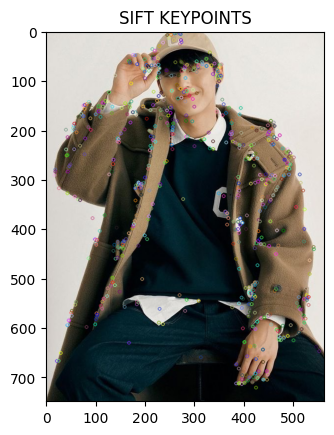
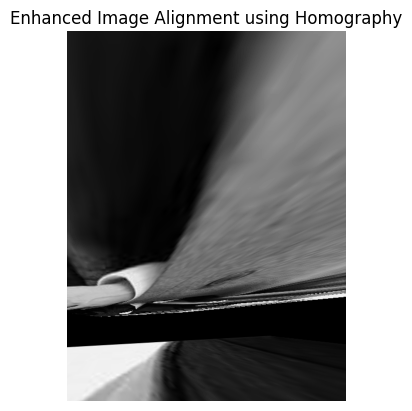
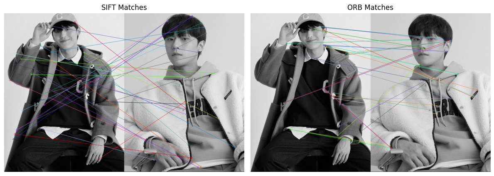

# Installation of OPENCV_CONTRIB

```python
!apt-get update
!apt-get install -y cmake build-essential pkg-config

!git clone https://github.com/opencv/opencv.git
!git clone https://github.com/opencv/opencv_contrib.git

!mkdir -p opencv/build
%cd opencv/build
!cmake -D CMAKE_BUILD_TYPE=RELEASE \
        -D CMAKE_INSTALL_PREFIX=/usr/local \
        -D OPENCV_ENABLE_NONFREE=ON \
        -D OPENCV_EXTRA_MODULES_PATH=../../opencv_contrib/modules \
        -D BUILD_EXAMPLES=OFF ..
!make -j8
!make install
```

# Task 1: SIFT Feature Extraction

**SIFT Feature Extraction**
SIFT (Scale-Invariant Feature Transform) detects important points, called keypoints, in an image. These keypoints represent distinct and unique features, such as corners or edges, that can be identified even if the image is resized, rotated, or transformed. SIFT generates a descriptor for each keypoint, which helps in matching these points across images. The code first loads the image, converts it to grayscale (because many feature detectors work better on grayscale images), and then uses the SIFT algorithm to detect keypoints. The keypoints are visualized on the image

**Key Points:**
* Keypoints are important image features.
* Descriptors are used to describe and match these keypoints

1. Load an image of your choice.
```python
image = cv2.imread("/content/dohyun.jpg")
gray_image = cv2.cvtColor(image, cv2.COLOR_BGR2GRAY)
```
2. Use the SIFT (Scale-Invariant Feature Transform) algorithm to detect and compute keypoints and
descriptors in the image.
```python
sift = cv2.SIFT_create()
keypoints, descriptors = sift.detectAndCompute(gray_image, None)
image_with_keypoints = cv2.drawKeypoints(image,keypoints,None)
```
3. Visualize the keypoints on the image and display the result.
```python
plt.imshow(cv2.cvtColor(image_with_keypoints,cv2.COLOR_BGR2RGB))
plt.title('SIFT Keypoints')
plt.show()
```


# Task 2: SURF Feature Extraction

**SURF Feature Extraction**
SURF (Speeded-Up Robust Features) is similar to SIFT but is optimized for speed. SURF focuses on finding features faster, making it useful for real-time applications. It also detects keypoints and generates descriptors but uses a different mathematical approach to SIFT. In the code, SURF is used to detect keypoints in a grayscale image, and the keypoints are visualized similarly to SIFT. The performance of SURF is usually faster than SIFT, but it might miss certain keypoints that SIFT would detect.

**Key Points:**
* SURF is faster than SIFT.
* It can be a good choice for real-time applications.

1. Load a different image (or the same one)
```python
image = cv2.imread('/content/dohyun.jpg')
gray_image = cv2.cvtColor(image, cv2.COLOR_BGR2GRAY)
```
2. Apply the SURF (Speeded-Up Robust Features) algorithm to detect and compute keypoints and descriptors
```python
surf = cv2.xfeatures2d.SURF_create()
keypoints, descriptors = surf.detectAndCompute(gray_image, None)
image_with_keypoints = cv2.drawKeypoints(image, keypoints, None)
```

3. Visualize the keypoints on the image and display the result.
```python
plt.imshow(cv2.cvtColor(image_with_keypoints, cv2.COLOR_BGR2RGB))
plt.title('SURF Keypoints')
plt.show()
```


# Task 3: ORB Feature Extraction

**ORB Feature Extraction**
ORB (Oriented FAST and Rotated BRIEF) is a feature detection algorithm that is both fast and computationally less expensive than SIFT and SURF. It is ideal for real-time applications, particularly in mobile devices. ORB combines two methods: FAST (Features from Accelerated Segment Test) to detect keypoints and BRIEF (Binary Robust Independent Elementary Features) to compute descriptors. The code uses ORB to detect keypoints and display them on the image. Unlike SIFT and SURF, ORB is more focused on speed and efficiency, which makes it suitable for applications that need to process images quickly.

**Key Points:**
* ORB is a fast alternative to SIFT and SURF.
* It’s suitable for real-time and resource-constrained environments

1. Apply the ORB (Oriented FAST and Rotated BRIEF) algorithm to detect keypoints and compute
descriptors on another image

```python
image = cv2.imread('/content/dohyun.jpg')
gray_image = cv2.cvtColor(image,cv2.COLOR_BGR2GRAY)

orb = cv2.ORB_create()

keypoints,descriptors = orb.detectAndCompute(gray_image,None)

image_with_keypoints = cv2.drawKeypoints(image,keypoints,None)
```

2. Visualize and display the keypoints.
```python
plt.imshow(cv2.cvtColor(image_with_keypoints,cv2.COLOR_BGR2RGB))
plt.title('ORB Keypoints')
plt.show()
```


# **Task 4: Feature Matching**

**Feature Matching using SIFT**
In this exercise, **feature matching** is used to find similar points between two images. After detecting keypoints using SIFT, the algorithm uses a **Brute-Force Matcher** to find matching keypoints between two images. The matcher compares the descriptors of the keypoints and finds pairs that are similar. In the code, we load two images, detect their keypoints and descriptors using SIFT, and then use the matcher to draw lines between matching keypoints. The lines show which points in the first image correspond to points in the second image.

**Key Points:**
* Feature matching helps compare and find similarities between two images.
* The Brute-Force Matcher finds the closest matching descriptors

1. Using the keypoints and descriptors obtained from the previous tasks (e.g., SIFT, SURF, or ORB),
match the features between two different images using Brute-Force Matching or FLANN (Fast
Library for Approximate Nearest Neighbors).
```python
image1 = cv2.imread('/content/dohyun.jpg',0)
image2 = cv2.imread('/content/dohyun2.jpg',0)

sift = cv2.SIFT_create()

keypoints1, descriptors1 = sift.detectAndCompute(image1,None)
keypoints2, descriptors2 = sift.detectAndCompute(image2,None)

bf = cv2.BFMatcher(cv2.NORM_L2, crossCheck=True)
matches = bf.match(descriptors1, descriptors2)

matches = sorted(matches, key=lambda x: x.distance)

image_matches = cv2.drawMatches(image1, keypoints1, image2, keypoints2, matches[:10], None, flags=cv2.DrawMatchesFlags_NOT_DRAW_SINGLE_POINTS)
```

2. Display the matched keypoints on both images.
```python
plt.imshow(image_matches)
plt.title('Feature Matching with SIFT')
plt.show()
```


# **Task 5: Application of Feature Matching**

**Real-World Applications (Image Stitching using Homography)** In this task, you use matched keypoints from two images to align or "stitch" them together. Homography is a mathematical transformation that maps points from one image to another, which is useful for aligning images taken from different angles or perspectives. This process is used in image stitching (e.g., creating panoramas), where you align and merge images to form a larger one. The code uses the keypoints matched between two images and calculates the homography matrix. This matrix is then used to warp one image to align it with the other.

**Key Points:**
* Homography is used to align images.
* This is useful in applications like panoramic image creation or object recognition.
```python
image1 = cv2.imread('/content/dohyun.jpg')
image2 = cv2.imread('/content/dohyun2.jpg')

gray1 = cv2.cvtColor(image1,cv2.COLOR_BGR2GRAY)
gray2 = cv2.cvtColor(image2,cv2.COLOR_BGR2GRAY)

sift = cv2.SIFT_create()
keypoints1, descriptors1 = sift.detectAndCompute(gray1,None)
keypoints2, descriptors2 = sift.detectAndCompute(gray2,None)

bf = cv2.BFMatcher(cv2.NORM_L2)
matches = bf.knnMatch(descriptors1,descriptors2, k=2)

good_matches =[]
for m,n in matches:
  if m.distance < 0.75* n.distance:
    good_matches.append(m)

src_pts = np.float32(
    [keypoints1[m.queryIdx].pt for m in good_matches]
).reshape(-1,1,2)
dst_pts = np.float32(
    [keypoints2[m.trainIdx].pt for m in good_matches]
).reshape(-1,1,2)

M, masl = cv2.findHomography(src_pts,dst_pts, cv2.RANSAC,5.0)

h,w,_ = image1.shape

result = cv2.warpPerspective(image1, M, (w,h))

plt.imshow(cv2.cvtColor(result,cv2.COLOR_BGR2RGB))
plt.title("Image Alignment Using Homography")
plt.show()
```



# Task 6: Combining Feature Extraction Methods
**Combining SIFT and ORB** By combining two feature extraction methods (SIFT and ORB), you can take advantage of the strengths of both. For example, SIFT is more accurate, but ORB is faster. By detecting keypoints using both methods, you can compare how they perform on different types of images and possibly combine their outputs for more robust feature detection and matching. In the code, we extract keypoints from two images using both SIFT and ORB, and then you can use a matcher to compare and match the features detected by both methods.

**Key Points:**
* Combining methods can improve performance in some applications.
* SIFT is accurate, while ORB is fast, making them complementary in certain tasks

1. Combine multiple feature extraction methods (e.g., SIFT + ORB) to extract features and match
them between two images.

```python
import cv2

image1 = cv2.imread('/content/dohyun.jpg', 0)
image2 = cv2.imread('/content/dohyun2.jpg', 0)

sift = cv2.SIFT_create()
keypoints1_sift, descriptors1_sift = sift.detectAndCompute(image1, None)
keypoints2_sift, descriptors2_sift = sift.detectAndCompute(image2, None)

orb = cv2.ORB_create()
keypoints1_orb, descriptors1_orb = orb.detectAndCompute(image1, None)
keypoints2_orb, descriptors2_orb = orb.detectAndCompute(image2, None)
```
2. Display the combined result
```python
bf_sift = cv2.BFMatcher(cv2.NORM_L2, crossCheck=True)
matches_sift = bf_sift.match(descriptors1_sift, descriptors2_sift)
matches_sift = sorted(matches_sift, key=lambda x: x.distance)

bf_orb = cv2.BFMatcher(cv2.NORM_HAMMING, crossCheck=True)
matches_orb = bf_orb.match(descriptors1_orb, descriptors2_orb)
matches_orb = sorted(matches_orb, key=lambda x: x.distance)

image_sift_matches = cv2.drawMatches(image1, keypoints1_sift, image2, keypoints2_sift, matches_sift[:30], None, flags=cv2.DrawMatchesFlags_NOT_DRAW_SINGLE_POINTS)

image_orb_matches = cv2.drawMatches(image1, keypoints1_orb, image2, keypoints2_orb, matches_orb[:30], None, flags=cv2.DrawMatchesFlags_NOT_DRAW_SINGLE_POINTS)

plt.figure(figsize=(12, 6))

plt.subplot(1, 2, 1)
plt.imshow(image_sift_matches)
plt.title('SIFT Matches')
plt.axis('off')

plt.subplot(1, 2, 2)
plt.imshow(image_orb_matches)
plt.title('ORB Matches')
plt.axis('off')

plt.tight_layout()
plt.show()
```


