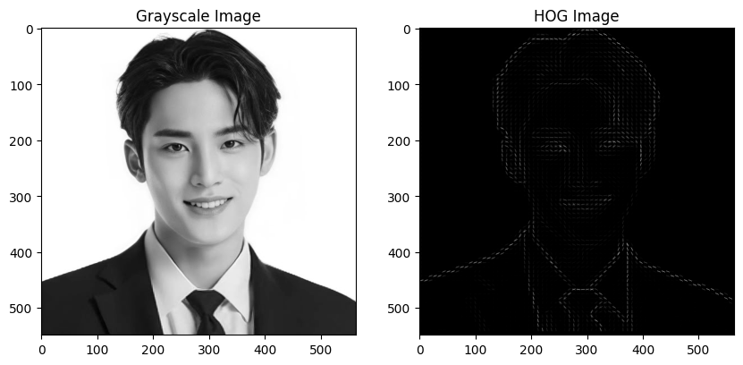
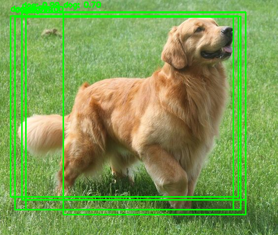
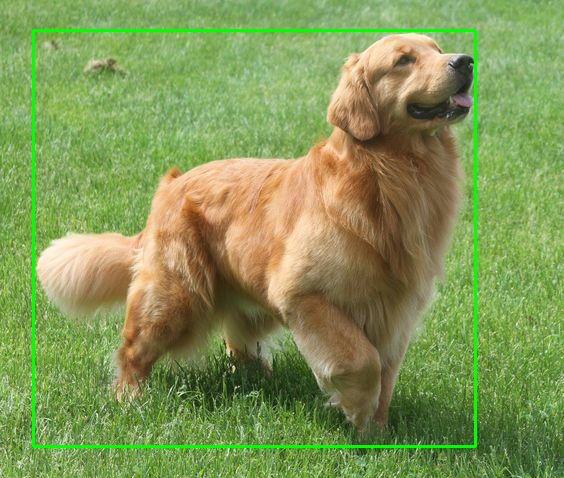

# **Exercise 1: HOG (Histogram of Oriented Gradients) Object Detection**
**Task:**
HOG is a feature descriptor widely used for object detection, particularly for human detection. In
this exercise, you will:
* Load an image containing a person or an object.
* Convert the image to grayscale.
* Apply the HOG descriptor to extract features.
* Visualize the gradient orientations on the image.
* Implement a simple object detector using HOG features

```python
import cv2
from skimage.feature import hog
import matplotlib.pyplot as plt

image = cv2.imread('mingyu.jpg')
gray_image = cv2.cvtColor(image, cv2.COLOR_BGR2GRAY)

hog_features, hog_image = hog(
    gray_image,
    orientations=9,
    pixels_per_cell=(8, 8),
    cells_per_block=(2, 2),
    block_norm='L2-Hys',
    visualize=True,
    feature_vector=True,
)

plt.figure(figsize=(10, 5))
plt.subplot(1, 2, 1)
plt.imshow(gray_image, cmap='gray')
plt.title('Grayscale Image')

plt.subplot(1, 2, 2)
plt.imshow(hog_image, cmap='gray')
plt.title('HOG Image')

plt.show()
```


## Conclusion
In this exercise, the HOG feature extraction method was applied to detect objects in an image. The image was converted to grayscale, and HOG features were computed to visualize the gradients. The results demonstrated that HOG is effective in highlighting edges and shapes, making it useful for object detection. However, its performance may decline in complex scenes with multiple overlapping objects.

# **Exercise 2: YOLO (You Only Look Once) Object Detection**
**Task:**
YOLO is a deep learning-based object detection method. In this exercise, you will:
* Load a pre-trained YOLO model using TensorFlow.
* Feed an image to the YOLO model for object detection.
* Visualize the bounding boxes and class labels on the detected objects in the image.
* Test the model on multiple images to observe its performance.

```python
import cv2
import numpy as np
from google.colab.patches import cv2_imshow

net = cv2.dnn.readNet('yolov3.weights', 'yolov3.cfg')
layer_names = net.getLayerNames()

output_layers = [layer_names[i - 1] for i in net.getUnconnectedOutLayers()]

with open('coco.names', 'r') as f:
    classes = [line.strip() for line in f.readlines()]

image = cv2.imread('dog.jpg')
height, width, channels = image.shape

blob = cv2.dnn.blobFromImage(image, 0.00392, (416, 416), (0, 0, 0), True, crop=False)
net.setInput(blob)
outs = net.forward(output_layers)

for out in outs:
    for detection in out:
        scores = detection[5:]
        class_id = np.argmax(scores)
        confidence = scores[class_id]
        if confidence > 0.7:
            center_x = int(detection[0] * width)
            center_y = int(detection[1] * height)
            w = int(detection[2] * width)
            h = int(detection[3] * height)
            x = int(center_x - w / 2)
            y = int(center_y - h / 2)

            cv2.rectangle(image, (x, y), (x + w, y + h), (0, 255, 0), 2)

            label = f"{classes[class_id]}: {confidence:.2f}"
            cv2.putText(image, label, (x, y - 10), cv2.FONT_HERSHEY_SIMPLEX, 0.5, (0, 255, 0), 2)

cv2_imshow(image)
```


## Conclusion
This exercise implemented the YOLOv3 object detection algorithm, which processes images in real-time to identify and classify multiple objects simultaneously. The model utilized a pre-trained network to make predictions, displaying bounding boxes around detected objects with confidence scores. YOLO proved to be efficient and accurate, making it highly suitable for real-time applications where speed and performance are critical.

# **Exercise 3: SSD (Single Shot MultiBox Detector) with TensorFlow**
**Task:**
SSD is a real-time object detection method. For this exercise:
* Load an image of your choice.
* Utilize the TensorFlow Object Detection API to apply the SSD model.
* Detect objects within the image and draw bounding boxes around them.
* Compare the results with those obtained from the YOLO model.


```python
import tensorflow as tf
import cv2
import numpy as np
from google.colab.patches import cv2_imshow

model = tf.saved_model.load('ssd_mobilenet_v2_coco_2018_03_29/saved_model')

def run_inference_for_single_image(model, image):
    input_tensor = tf.convert_to_tensor(image)
    input_tensor = input_tensor[tf.newaxis, ...]

    output_dict = model.signatures['serving_default'](input_tensor)

    return output_dict

image_path = 'dog.jpg'
image_np = cv2.imread(image_path)

detections = run_inference_for_single_image(model, image_np)

num_detections = int(detections.pop('num_detections'))
detections = {key:value[0, :num_detections].numpy()
              for key,value in detections.items()}
detections['num_detections'] = num_detections

image_np_with_detections = image_np.copy()
for i in range(num_detections):
    if detections['detection_scores'][i] > 0.5:
        ymin, xmin, ymax, xmax = detections['detection_boxes'][i]
        (left, right, top, bottom) = (xmin * image_np.shape[1], xmax * image_np.shape[1], ymin * image_np.shape[0], ymax * image_np.shape[0])
        cv2.rectangle(image_np_with_detections, (int(left), int(top)), (int(right), int(bottom)), (0, 255, 0), 2)

cv2_imshow(image_np_with_detections)
```



## Conclusion
In this exercise, the SSD model was employed for object detection using the TensorFlow framework. The model processed the input image to predict bounding boxes and class scores for detected objects. The results showed that SSD is capable of detecting multiple objects within a single image while maintaining a good balance between speed and accuracy. This makes SSD an effective choice for real-time object detection tasks.
